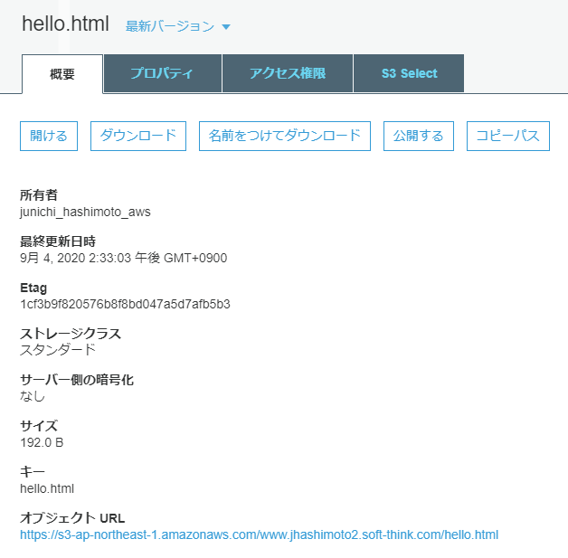
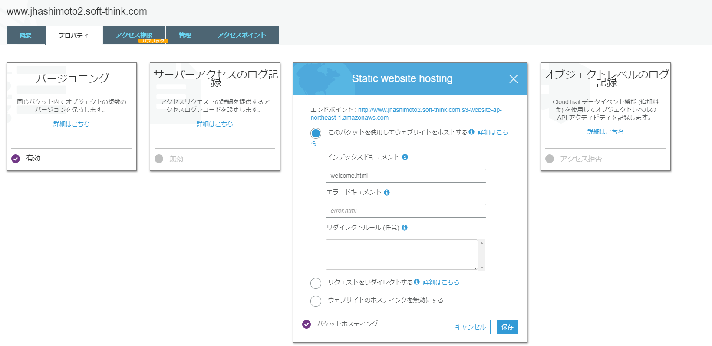

# Webサイトを公開する

## ゴール
バケットに格納したコンテンツをWebサイトとして公開する。

## ステップ
1. バケットの作成
2. バケットのWebサイト構成を設定する
3. コンテンツアップロード
4. コンテンツを公開する

## 環境変数を設定する

```bash+=
$ cd
$ pwd
/home/ec2-user
$ vim .bashrc
```

.bashrcに以下を追記する。環境変数`ID`には、自分の名前を入れる。

```bash=
export ID=jhashimoto
export S3_BUCKET_NAME=www.$ID.soft-think.com
```

ログイン中のシェルに環境変数を反映させる。

```bash+=
$ source .bashrc  # . .bashrc でも同じ。
$ echo $S3_BUCKET_NAME
www.jhashimoto.soft-think.com
```

## バケットの作成
```bash=+
$ aws s3api create-bucket \
--bucket $S3_BUCKET_NAME \
--acl public-read \
--create-bucket-configuration LocationConstraint=ap-northeast-1
{
    "Location": "http://www.jhashimoto.soft-think.com.s3.amazonaws.com/"
}
$ aws s3 ls
2020-08-16 16:30:53 www.jhashimoto.soft-think.com
```

## コンテンツ作成

ホームディレクトリ直下にコンテンツディレクトリ (`html`)を作成し、移動する。
```bash=+
$ cd
$ pwd
/home/ec2-user
$ mkdir html
$ cd html
$ pwd
/home/ec2-user/html
```

htmlファイルを作成する。

**welcome.html**

```bash=+
$ vim welcome.html
```
```html=
<html xmlns="http://www.w3.org/1999/xhtml" >
<head>
    <title>My Website Home Page</title>
</head>
<body>
  <h1>Welcome to my website</h1>
  <p>Now hosted on Amazon S3!</p>
</body>
</html>
```

**hello.html**
```bash=+
$ vim hello.html
```

```html=
<html xmlns="http://www.w3.org/1999/xhtml" >
<head>
    <title>Hello my Website Home Page</title>
</head>
<body>
  <h1>Hello my website</h1>
  <p>Now hosted on Amazon S3!</p>
</body>
</html>
```

## バケットのWebサイト構成を設定する

デフォルトコンテンツは、welcome.html。

```bash=+
$ aws s3 website s3://$S3_BUCKET_NAME \
--index-document welcome.html
```

## コンテンツアップロード
```bash=+
$ aws s3 cp ~/html s3://$S3_BUCKET_NAME \
--recursive
upload: ./hello.html to s3://www.jhashimoto.soft-think.com/hello.html
upload: ./welcome.html to s3://www.jhashimoto.soft-think.com/welcome.html
```

## コンテンツを公開する
welcome.htmlをリクエストすると、`AccessDenied`。読み取り権限がないため。

```bash=+
$ curl http://www.$ID.soft-think.com.s3-website-ap-northeast-1.amazonaws.com/welcome.html
<html>
<head><title>403 Forbidden</title></head>
<body>
<h1>403 Forbidden</h1>
<ul>
<li>Code: AccessDenied</li>
<li>Message: Access Denied</li>
<li>RequestId: 9113FB676D6CF0FA</li>
<li>HostId: N4k6n3V5Gct/mFzSPDUtQM8y+29iAW9xGAINNrbDdfemVz3bnGmPz5p42dBcvgXQ12atcr9vXv8=</li>
</ul>
<hr/>
</body>
</html>
```

### 匿名ユーザーへの読み取り専用アクセスを許可する
読み取り専用アクセスを許可するために、アクセス権限を記述したバケットポリシーをバケットに適用する。

#### バケットポリシーとは
IAMポリシーには、S3リソース（バケット、オブジェクト）に対するアクセス許可を付与する機能がある。これをバケットポリシーと呼ぶ。

#### IAMポリシーとは
IAMユーザー/グループ/ロールやリソースに関連付けて、これらのアクセス許可を定義する。

#### バケットポリシー定義ファイルを作成

```bash=+
$ cd ..
$ pwd
/home/ec2-user
$ vim www_bucket_policy.json
```

**www_bucket_policy.json**

| プレースホルダー | 意味 | 例 |
| -------- | -------- | -------- |
| {BUCKET_NAME}     | バケット名 | www.jhashimoto.soft-think.com  |

```json=
{
    "Version": "2012-10-17",
    "Statement": [
        {
            "Effect": "Allow",
            "Principal": "*",
            "Action": "s3:GetObject",
            "Resource": [
                "arn:aws:s3:::{BUCKET_NAME}",
                "arn:aws:s3:::{BUCKET_NAME}/*"
            ]
        }
    ]
}
```

### バケットポリシー適用
バケットポリシーを適用する。

```bash=+
aws s3api put-bucket-policy \
--bucket $S3_BUCKET_NAME \
--policy file://www_bucket_policy.json
```

バケットポリシーの適用で、以下の`Access Denied`エラーが発生する場合は、バケットのパブリックアクセスブロックを解除すること。(補足資料: バケットのパブリックアクセスブロック解除 を参照のこと）

```bash
An error occurred (AccessDenied) when calling the PutBucketPolicy operation: Access Denied
```

### 公開されたことを確認
再び、welcome.htmlをリクエストすると、レスポンスが返ってきた。

```bash=+
$ curl http://www.$ID.soft-think.com.s3-website-ap-northeast-1.amazonaws.com/welcome.html
<html xmlns="http://www.w3.org/1999/xhtml" >
<head>
    <title>My Website Home Page</title>
</head>
<body>
  <h1>Welcome to my website</h1>
  <p>Now hosted on Amazon S3!</p>
</body>
</html>
```

hello.htmlも確認する。

```bash=+
$ curl http://www.$ID.soft-think.com.s3-website-ap-northeast-1.amazonaws.com/hello.html
<html xmlns="http://www.w3.org/1999/xhtml" >
<head>
    <title>Hello my Website Home Page</title>
</head>
<body>
  <h1>Hello my website</h1>
  <p>Now hosted on Amazon S3!</p>
</body>
</html>

```

デフォルトコンテンツは、welcome.htmlになっている。

```bash=+
$ curl http://www.$ID.soft-think.com.s3-website-ap-northeast-1.amazonaws.com/
<html xmlns="http://www.w3.org/1999/xhtml" >
<head>
    <title>My Website Home Page</title>
</head>
<body>
  <h1>Welcome to my website</h1>
  <p>Now hosted on Amazon S3!</p>
</body>
</html>
```

## ブラウザからテスト

ブラウザからWebサイトにアクセスして、コンテンツが表示されればOK。

URLは、http://www.{ID}.soft-think.com.s3-website-ap-northeast-1.amazonaws.com/

`{ID}`は自分のIＤで置き換えること。

## FAQ

### テストに使用するURLとマネジメントコンソールで確認できるURLの書式が異なるのはなぜですか？

S3のオブジェクトにはユニークなURLが割り当てられ、個別に公開することができます。これがマネジメントコンソールの`オブジェクトURL`です。


手順書に記載したURLは、ウェブサイトホスティングのエンドポイントです。


ウェブサイトが公開されたことをテストしたいので、この実習では後者を使用します。

## 補足資料

### バケットのパブリックアクセスブロック解除

バケットのパブリックアクセスブロックを確認する。

```bash=+
$ aws s3api get-public-access-block \
--bucket $S3_BUCKET_NAME
{
    "PublicAccessBlockConfiguration": {
        "BlockPublicAcls": true,
        "IgnorePublicAcls": true,
        "BlockPublicPolicy": true,
        "RestrictPublicBuckets": true
    }
}
```

パブリックアクセスブロックを解除する。

```bash=+
$ aws s3api put-public-access-block \
--bucket $S3_BUCKET_NAME \
--public-access-block-configuration "BlockPublicAcls = false"
$ aws s3api get-public-access-block \
--bucket $S3_BUCKET_NAME
{
    "PublicAccessBlockConfiguration": {
        "BlockPublicAcls": false,
        "IgnorePublicAcls": false,
        "BlockPublicPolicy": false,
        "RestrictPublicBuckets": false
    }
}
```

## 参考
[バケットポリシーの例 \- Amazon Simple Storage Service](https://docs.aws.amazon.com/ja_jp/AmazonS3/latest/dev/example-bucket-policies.html#example-bucket-policies-use-case-2)
