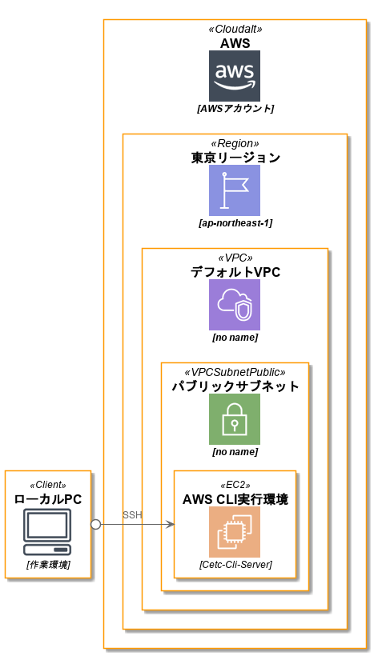
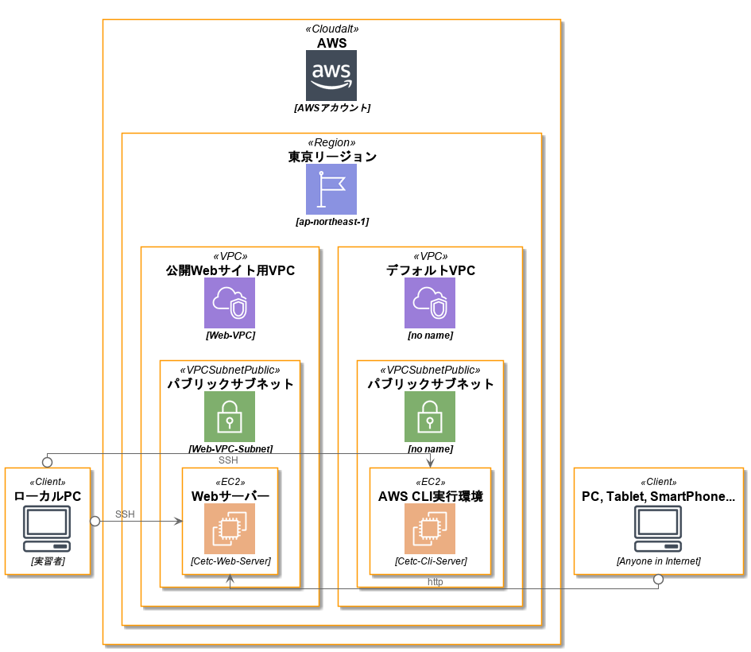

# Introduction

## ゴール
- EC2インスタンスにホスティングした動的Webサイトをインターネットに公開する

## ステップ
1. VPCを作成する
2. 作成したVPC内にEC2インスタンスを作成する
3. EC2インスタンスをWebサーバーとして構成する

## VPCとは

- 教科書
    - 5.3 VPCによる仮想ネットワーク構築
- デフォルトVPCとは

## システム構成

### 現在（day-01完了）



### day-02のゴール



## SSH接続のセッションについて
しばらく操作がない状態が続くと、SSHのセッションが切断されてしまう。

次の設定で対応できる。

```bash
$ sudo su -
# cd /etc/ssh
# pwd
/etc/ssh
# cp sshd_config sshd_config_org
# ls -l | grep sshd_config
-rw------- 1 root root       3957 Aug 28 00:47 sshd_config
-rw------- 1 root root       3957 Aug 28 00:46 sshd_config_org
```

**sshd_config**

```bash
110c110
< #ClientAliveInterval 0
---
> ClientAliveInterval 60
```

SSHのデーモンを再起動する。
```bash
# systemctl restart sshd.service
```

