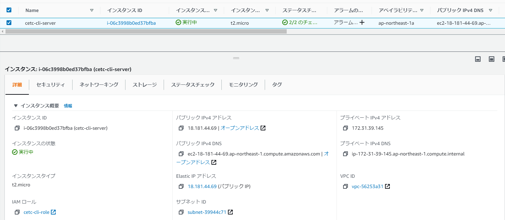

# Elastic IPとは

EC2インスタンスを停止すると、インスタンスに付与されていたパブリックIPアドレスは解放される[^1]。そして、停止中のインスタンスを開始すると、停止前のパブリックIPアドレスとは異なるIPアドレスが付与される。

これでは、停止するたびにIPアドレスの変更を周知しなければ、クライアントから接続できなくなってしまうので、都合が悪い。

これを避けるため、インスタンスを多数のクライアントに利用させる場合は、固定IPを割り当てる。

EC2インスタンスに固定IPを割り当てるには、Elastic IPを使う。Elastic IPはEC2サービスの１機能である。

## 教科書

- 3.5 Elastic IPを使った独自ドメインでのサイト運用

## 解放した固定IPの復旧

解放した固定IPは、条件を満たしていれば再び取得できるが、すでに他ユーザーに割り当てられてしまった場合は取得できないので、あてにしないほうがよい。

[Elastic IP アドレス - Amazon Elastic Compute Cloud](https://docs.aws.amazon.com/ja_jp/AWSEC2/latest/UserGuide/elastic-ip-addresses-eip.html#using-eip-recovering)

## 課金について

Elastic IPは、無料利用枠に**含まれない**。

次のルールで課金される。金額は0.005USD/1h。

- 稼働中のEC2インスタンスに関連付けられている
  
    - 無料
- 稼働中のインスタンスに関連付けられていない
    - 課金される
    1. 固定IPを取得したが、インスタンスに割り当てていない
	    - 不要な固定IPを解放することで課金を停止できる 
    2. 固定IPを割り当てたインスタンスが停止している
    	- 実運用では、インスタンス停止によるEC2使用料削減の方がはるかに金額が大きいので、固定IPの課金には目をつぶる

つまり、パブリックIPアドレスは有限なリソースなので、取得した固定IPを使わないと課金される。

他のケースとしては、１つのEC2インスタンスに複数の固定IPを割り当てている場合も、 追加分の固定IPについては課金される。

[Elastic IP の料金を理解する](https://aws.amazon.com/jp/premiumsupport/knowledge-center/elastic-ip-charges/)

# EC2インスタンスに固定IPを割り当てる

パブリックIPアドレスが変わるので、SSHで接続している場合は切断しておくこと。

固定IPアドレスを払い出す。出力の[PublicIp]と[AllocationId]をこの後使用するので、控えておくこと。

```bash=
aws ec2 allocate-address
{
    "PublicIp": "???.???.???.???",
    "AllocationId": "eipalloc-?????",
    "PublicIpv4Pool": "amazon",
    "NetworkBorderGroup": "ap-northeast-1",
    "Domain": "vpc"
}
```

払い出された固定IPアドレスをインスタンスに関連付ける。

```bash=
aws ec2 associate-address --instance-id i-06c3998b0ed37bfba --public-ip ???.???.???.???
{
    "AssociationId": "eipalloc-?????"
}
```

固定IPに名前を付ける。ここでは`cetc-cli-server-ip`とする。

```bash
$ aws ec2 create-tags --resources eipalloc-004dbe52a19eceab7 --tags "Key=Name,Value=cetc-cli-server-ip"
[ec2-user@ip-172-31-39-145 ~]$ aws ec2 describe-tags --filters "Name=resource-id,Values=eipalloc-?????"
{
    "Tags": [
        {
            "Key": "Name",
            "ResourceId": "eipalloc-?????",
            "ResourceType": "elastic-ip",
            "Value": "cetc-cli-server-ip"
        }
    ]
}
```

マネジメントコンソールで[Elastic IP アドレス]が割り当てられていることが確認できる。[パブリック IPv4アドレス]と[パブリック IPv4 DNS]にもElastic IP アドレスが適用されている。



インスタンスを停止→開始して、パブリックIPアドレスが変わらないことを確認する。

[^1]: 再起動したときは、ブリックIPアドレスは解放されないので、再起動後も同じIPアドレスが付与される。