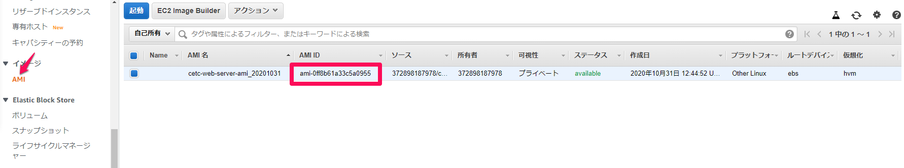
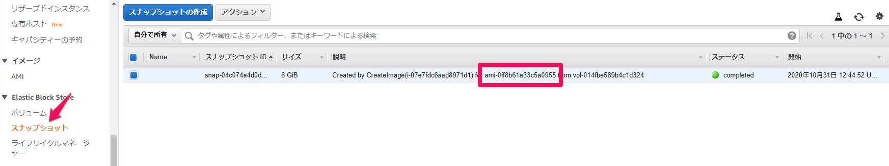

# EC2インスタンスのバックアップ

インスタンスのバックアップを取得したい場合は、インスタンスからAMIを取得する。

データの不整合を防ぐため、AMI取得を開始する前にインスタンスを停止する必要がある。

- 教科書
	- 3.3.2 EC2の基本用語

## ゴール
Cetc-Web-Serverのバックアップを取得する。

## ステップ
1. インスタンスを停止する
2. インスタンスのAMIを取得する

## 環境変数の設定

インスタンスIDを環境変数に設定する

**実行コマンド**
```bash
export WEB_EC2_INSTANCE_ID=`aws ec2 describe-instances \
--filters Name=tag:Name,Values="cetc-web-server" \
--query 'Reservations[].Instances[].InstanceId' \
--output text`
echo $WEB_EC2_INSTANCE_ID
```
## インスタンスの停止

インスタンスを停止する。

**実行コマンド**

```bash
aws ec2 stop-instances \
--instance-ids $WEB_EC2_INSTANCE_ID
```
**出力**

```bash
{
	"StoppingInstances": [
		{
			"CurrentState": {
				"Code": 64,
				"Name": "stopping"
			},
			"InstanceId": "i-???",
			"PreviousState": {
				"Code": 16,
				"Name": "running"
			}
		}
	]
}
```

**実行コマンド**
```bash
watch -d aws ec2 describe-instances \
--instance-ids $WEB_EC2_INSTANCE_ID \
--query 'Reservations[].Instances[].[State][].[Name]'
```
**出力**

`stopped`になるまで待つ。

```bash
Every 2.0s: aws ec2 describe-instances --instance-ids i-0...  server.mgt.local: Sun Jun 21 17:58:33 2020

[
	[
		"stopping"
	]
]
...
Every 2.0s: aws ec2 describe-instances --instance-ids i-0...  server.mgt.local: Sun Jun 21 17:58:55 2020

[
	[
		"stopped"
	]
]
```
## インスタンスのバックアップ
インスタンスからAMIを取得する。

| 属性       | 値                  |
| ---------- | ------------------- |
| リソース名 | cetc-web-server-ami_日付 |

**実行コマンド**
```bash
aws ec2 create-image \
--instance-id $WEB_EC2_INSTANCE_ID \
--name "cetc-web-server-ami_`date '+%Y%m%d'`"
```
**出力**
```bash
{
    "ImageId": "ami-???"
}
```

**実行コマンド**

```bash
watch -d aws ec2 describe-images \
--filters Name=name,Values="cetc-web-server-ami_`date '+%Y%m%d'`" \
--query 'Images[].[State]'
```
**出力**

`available`になれば、バックアップは完了している。

```bash
Every 2.0s: aws ec2 describe-images --filters Name=name,Values="cetc-web-server-ami_20201... Sun Jun 21 18:09:54 2020

[
    [
        "pending"
    ]
]
...
Every 2.0s: aws ec2 describe-images --filters Name=name,Values="cetc-web-server-ami_20201... Sun Jun 21 18:09:59 2020

[
    [
        "available"
    ]
]
```

EC2コンソールから作成されたAMIを確認できる。



AMIに関連付けられたスナップショットも作成される。[説明]にAMI IDが埋め込まれている。



## インスタンスの開始

必要であれば、インスタンスを開始する。

**実行コマンド**
```bash
aws ec2 start-instances \
--instance-ids $WEB_EC2_INSTANCE_ID
```

**出力**
```bash
{
	"StartingInstances": [
		{
			"CurrentState": {
				"Code": 0,
				"Name": "pending"
			},
			"InstanceId": "i-???",
			"PreviousState": {
				"Code": 80,
				"Name": "stopped"
			}
		}
	]
}
```

**実行コマンド**
```bash
watch -d \
aws ec2 describe-instances \
--instance-ids $WEB_EC2_INSTANCE_ID \
--query 'Reservations[].Instances[].[State][].[Name]'
```

**出力**

`running`になれば、開始されている。

```bash
Every 2.0s: aws ec2 describe-instances --instance-ids i-xxx --query 'Reserv... Sun Jun 21 17:59:31 2020

[
	[
		"pending"
	]
]
...
Every 2.0s: aws ec2 describe-instances --instance-ids i-xxx --query 'Reserv... Sun Jun 21 17:59:36 2020

[
	[
		"running"
	]
]
```
