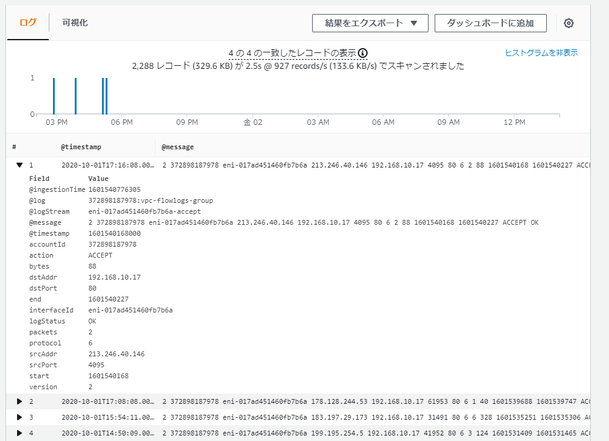
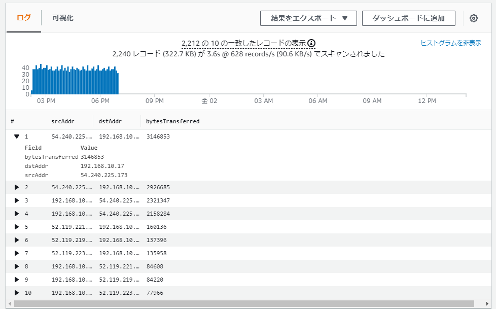
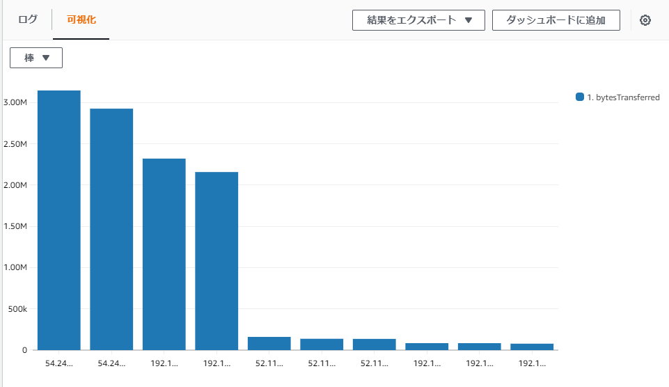
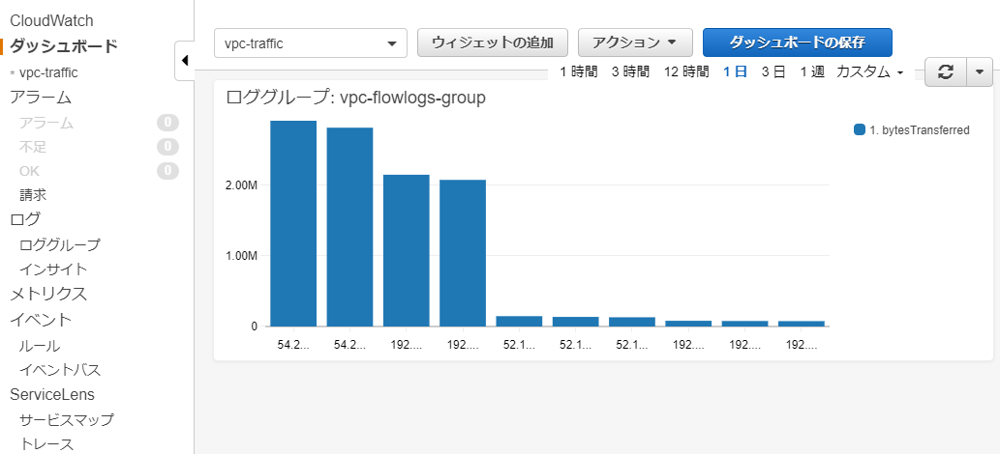
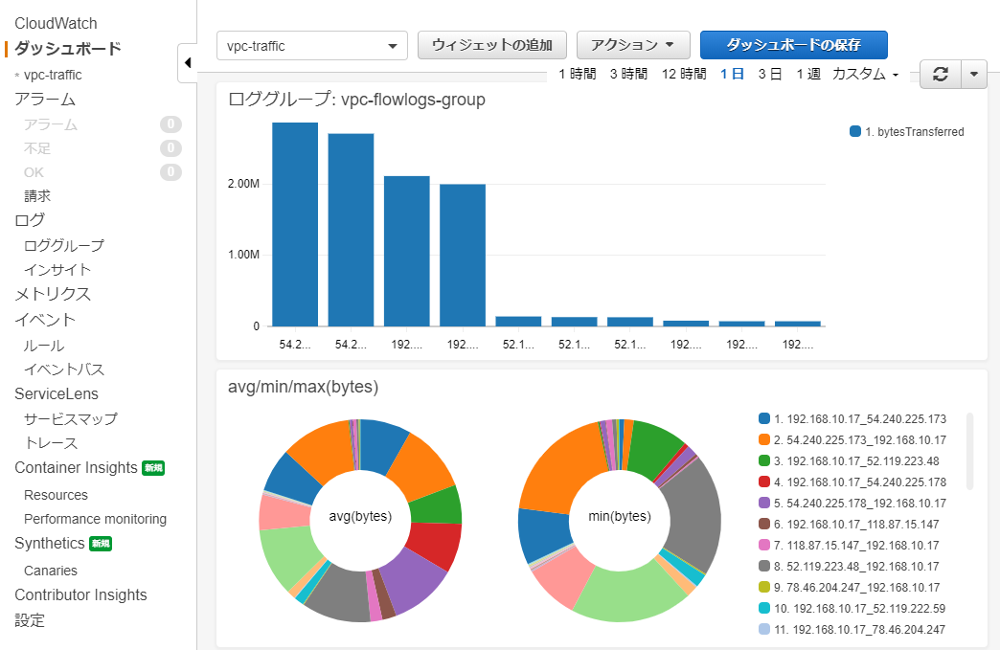

# VPCログの可視化

## ゴール

## ステップ

## VPCフローログとは

VPCフローログとは、VPCを送信元/送信先とするIPトラフィックをモニタリングし、ロギングする機能。

[VPC フローログ - Amazon Virtual Private Cloud](https://docs.aws.amazon.com/ja_jp/vpc/latest/userguide/flow-logs.html)

出力先は、Cloudwatch logsとS3から選択できる。

指定できるモニタリングの範囲は、広い順にVPC、サブネット、EC2インスタンスのネットワークインターフェース[^1]。

EC2以外のネットワークインターフェースも指定できる。

> 他の AWS サービスによって作成されたネットワークインターフェイスのフローログを作成できます。たとえば、次のとおりです。
> 
> Elastic Load Balancing
> Amazon RDS
> Amazon ElastiCache
> Amazon Redshift
> Amazon WorkSpaces
> NAT ゲートウェイ
> トランジットゲートウェイ

AWSの仮想ネットワークインターフェースはElastic Network Interface (ENI) と呼ばれる。

[AWSのネットワークインターフェース「ENI」とは｜コラム｜クラウドソリューション｜サービス｜法人のお客さま｜NTT東日本](https://business.ntt-east.co.jp/content/cloudsolution/column-14.html)

## Cloudwatch logsとは
Cloudwatchは、システム監視のサービス。Cloudwatch logsは、Cloudwatchの１機能で、AWS各サービスのログをCloudwatch logsに集約して、分析、視覚化できる。

## VPCフローログを有効にする

今回は、マネジメントコンソールから設定する。

[【新機能】VPC Flow LogsでVPC内のIPトラフィックを監視することができるようになりました! | Developers.IO](https://dev.classmethod.jp/articles/introduce-to-vpc-flow-log/)

1. CloudWatch Logsのグループを作成
2. IAMロール作成
3. VPCフローログ作成

## Logs Insightsでログを可視化する

Logs InsightsはCloudwatch logsのログを分析する機能。

SQLライクなクエリでログを抽出できる。

### HTTPサーバーへのリクエスト

```
filter dstPort = 80
```



### 送信元と送信先のペアを転送量の多い順にプロットする

```
stats sum(bytes) as bytesTransferred by srcAddr, dstAddr
| sort bytesTransferred desc
| limit 10
```



集計関数を使っていれば、値をプロット（グラフ化）できる。



常に監視対象にしたいなら、ダッシュボードにウィジェットとして追加する。




１つのダッシュボードには、複数のウィジェットを追加できる。



必要なウィジェットを追加しておけば、ダッシュボードを見るだけでシステムの状態を把握できる。

## Cloudwatchアラーム
TODO: メトリクス

Cloudwatchには、メトリクスが閾値に達したらアラームを発火させる機能がある。これをCloudwatchアラームという。

アラームの動作はカスタマイズできる。例えば、「EC2インスタンスのステータスチェックでエラーになったら、管理者に通知する」といった運用ができる。

EC2インスタンスのAuto Scalingには、Cloudwatchアラームが利用されている。アラームの動作を「インスタンスの追加」にすることでスケールアウトを実現できる。

## 後処理

### VPCフローログの削除

Cloudwatch logsは、ログ容量で従量課金されるので、VPCフローログは削除しておく。
無料利用枠は5 GB データ (取り込み、分析のためのスキャン）。

マネジメントコンソールから削除する。

[フローログを使用する - Amazon Virtual Private Cloud](https://docs.aws.amazon.com/ja_jp/vpc/latest/userguide/working-with-flow-logs.html#delete-flow-log)

VPCフローログを削除すると、Cloudwatch logsへのログ出力は停止されるが、蓄積されたログは削除されない。

[^1]: ネットワーク通信に必要なインターフェース。NIC（ネットワークインターフェースカード）とも呼ばれる。LANケーブルを指す箇所。
