# ビジュアルエディタによるポリシーの作成

## 学べること

- AWS管理ポリシーとカスタマー管理ポリシーを組み合わせて適用する方法
- ビジュアルエディタでポリシーを作成する方法

## 想定するユースケース

開発者に対して、EC2のすべての機能の使用を許可するが、Webサーバー用のインスタンスの停止/開始は許可しない。

## ステップ

1. AmazonEC2FullAccessPolicyをIAMユーザーにアタッチする
2. Webサーバー用インスタンスの停止/開始を拒否するカスタマー管理ポリシーを作成する
3. 作成したカスタマー管理ポリシーをIAMユーザーにアタッチする

## AmazonEC2FullAccessPolicyをユーザーにアタッチする
アタッチ済みの場合は不要。

## カスタマー管理ポリシーを作成する

ポリシーに設定するアクセス許可はJSONで定義する。ビジュアルエディタで、そのJSONをGUIで生成することができる。

この手順では、ビジュアルエディタで次のポリシーを作成する。

| 属性       | 値                                 | 説明 |
| ---------- | ---------------------------------- | ---- |
| ポリシー名 | DenyStopOrStartCetcWebServerPolicy |      |
| サービス           | EC2                                   |      |
| 許可/拒否 | 拒否  |   |
| アクション           | StopInstances/StartInstances | インスタンスの停止/開始 |
| リソース | Cetc-Web-ServerのARN | EC2コンソールで確認 |

以降の作業は、IAMコンソールから行う。

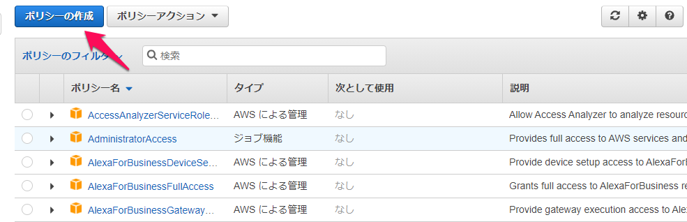

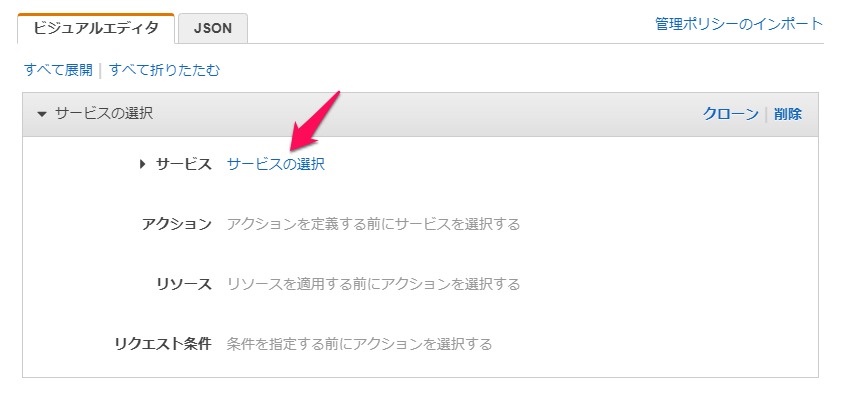

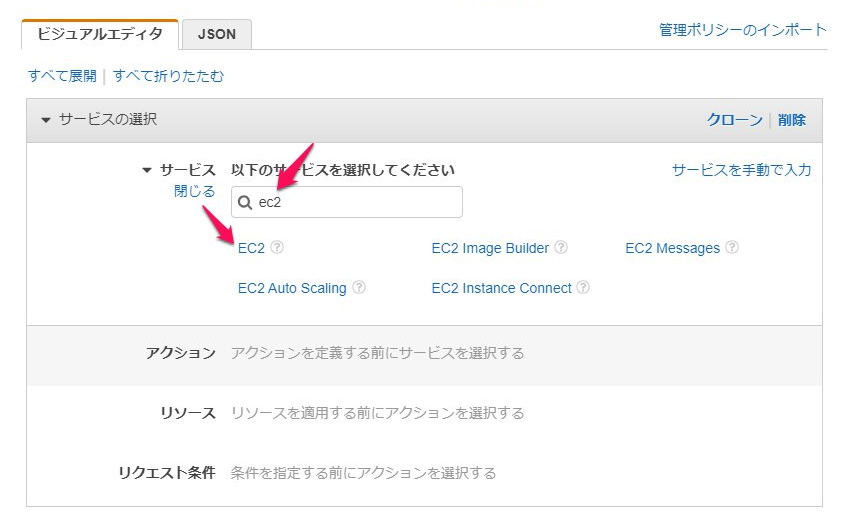

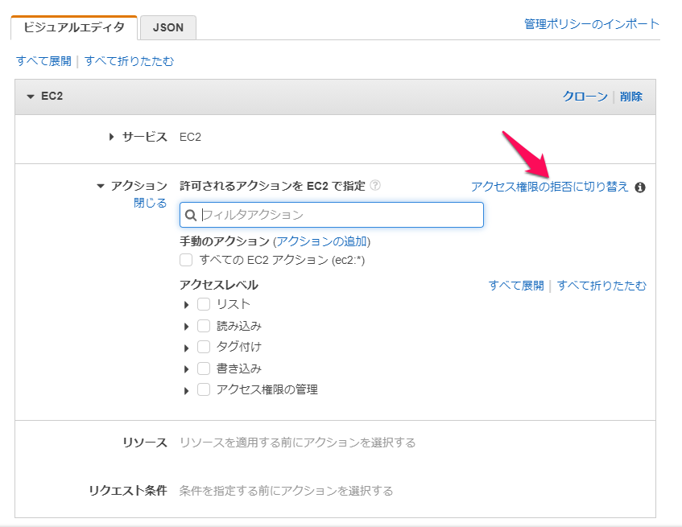

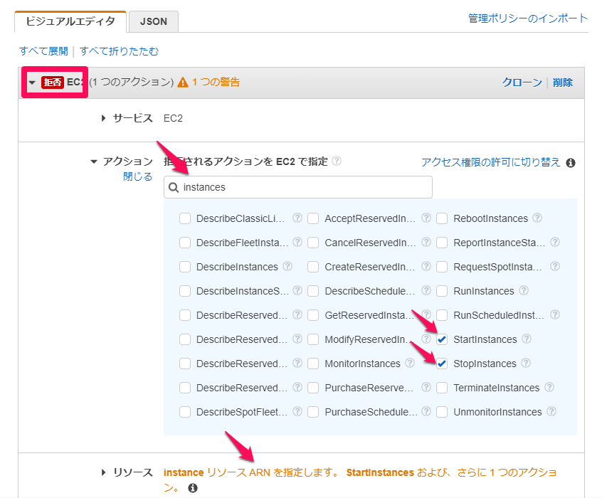

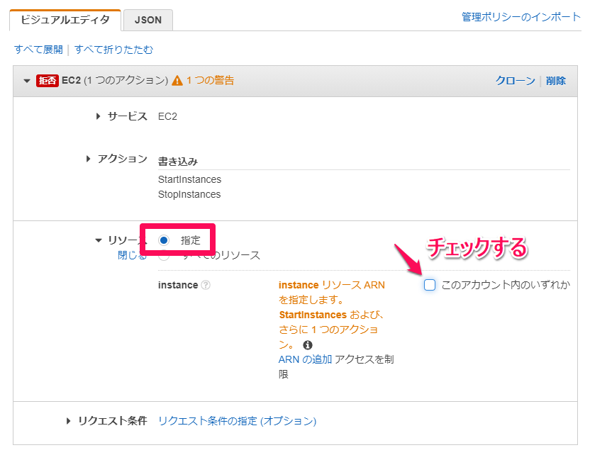

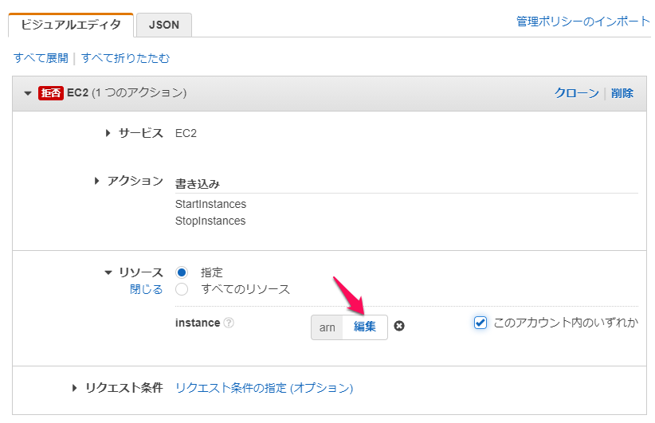

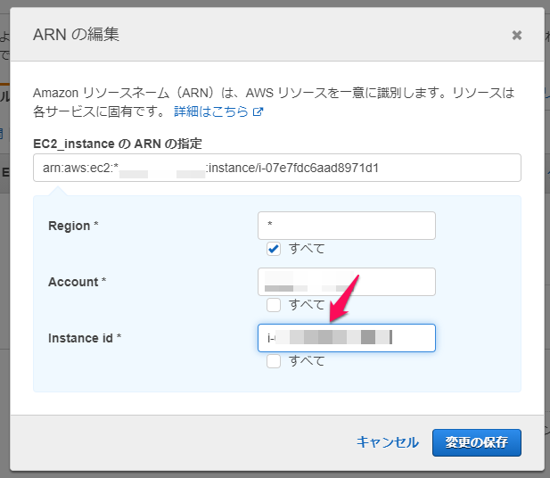

ビジュアルエディタで選択した内容をJSONで確認できる。

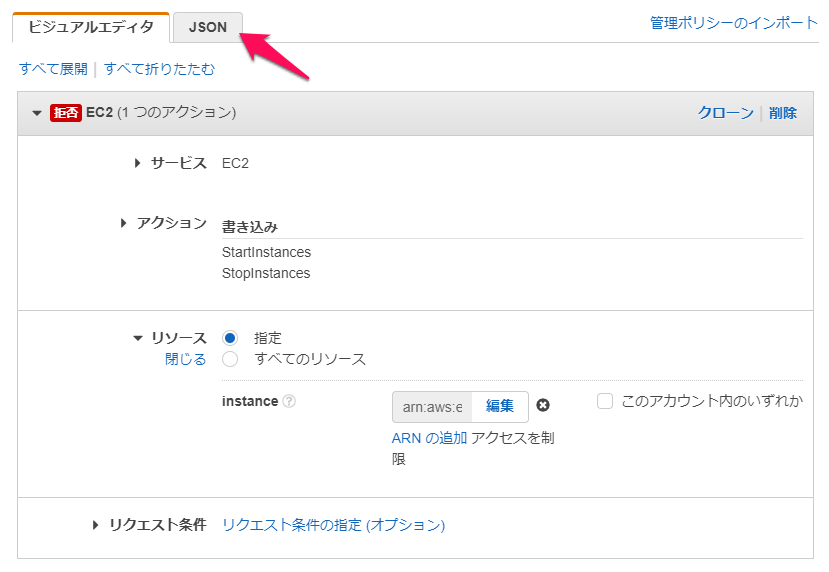

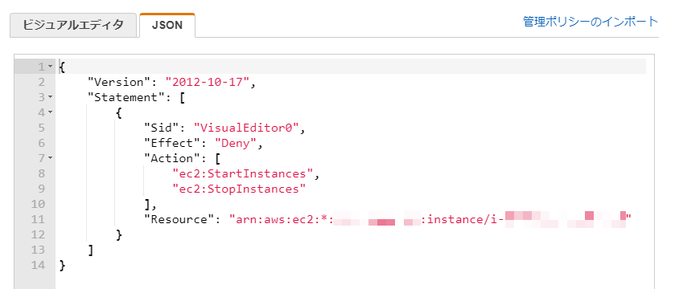

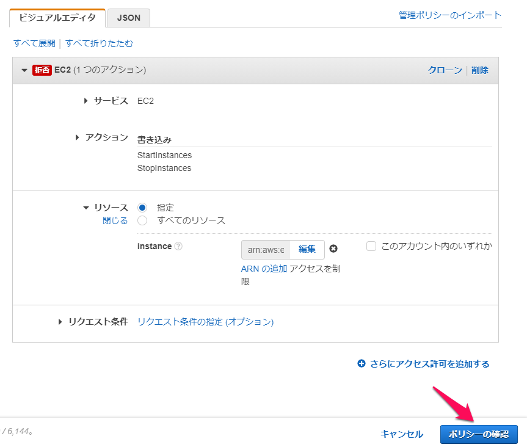

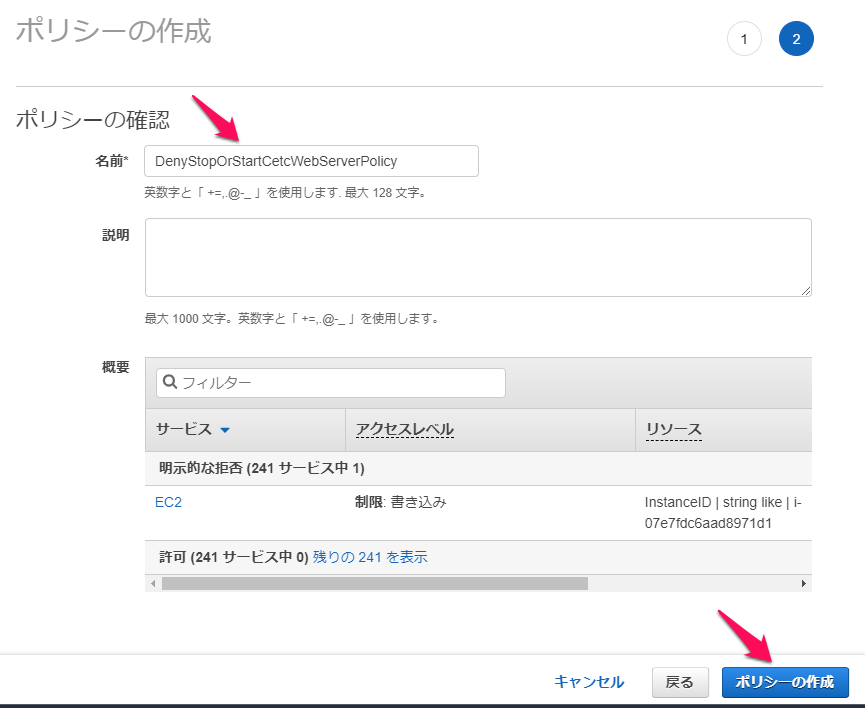

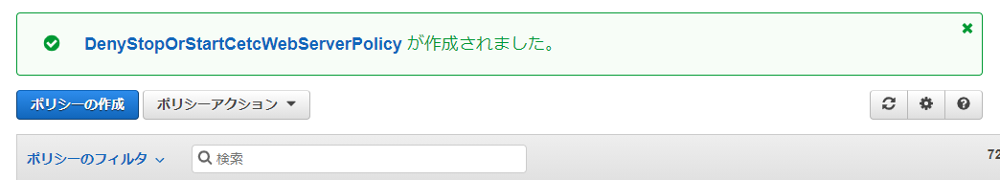

## カスタマー管理ポリシーをユーザーにアタッチする

## 動作確認

1. Cetc-Web-Serverの停止/開始ができないこと
1. Cetc-Cli-Serverの停止/開始ができること

## 後処理
1. AmazonEC2FullAccessPolicyをアタッチした場合は、ユーザーからデタッチする
1. DenyStopOrStartCetcWebServerPolicyをユーザーからデタッチする
1. 不要であれば、DenyStopOrStartCetcWebServerPolicyを削除する
