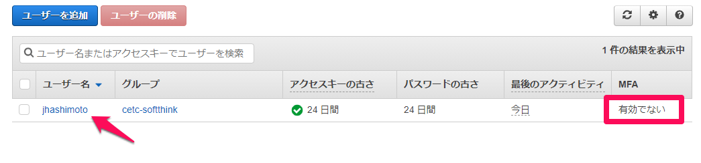
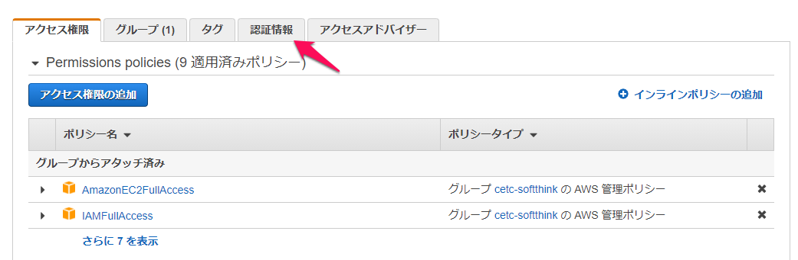
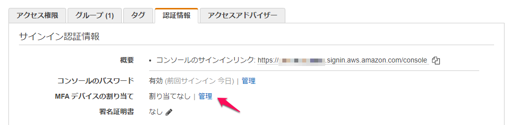
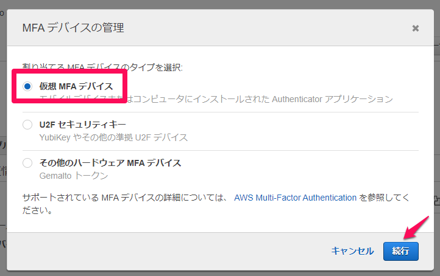
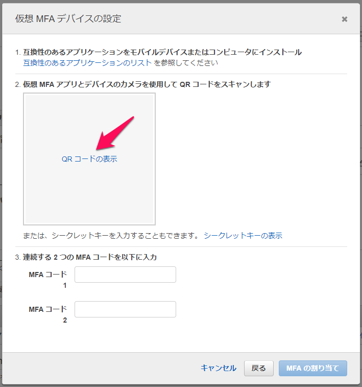
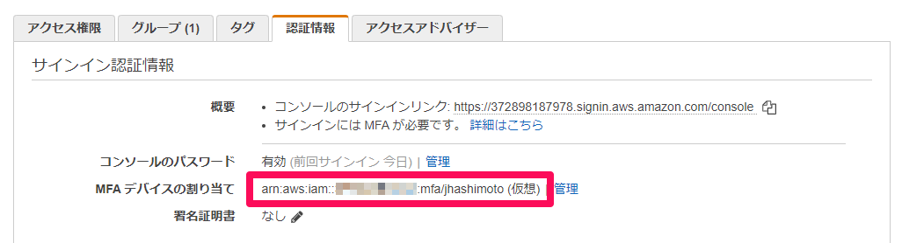

# IAMユーザーによる多要素認証


[AWS での多要素認証 (MFA) の使用 - AWS Identity and Access Management](https://docs.aws.amazon.com/ja_jp/IAM/latest/UserGuide/id_credentials_mfa.html)
> AWS は、間もなく SMS Multi-Factor Authentication (MFA) のサポートを終了します。


## ゴール

## ステップ

1.

## 前提
環境変数が設定されていること。

```bash
echo $S3_BUCKET_NAME
www.jhashimoto.soft-think.com
```

## 仮想MFAデバイスの有効化












1. アプリケーションをデバイスにインストールする。今回はGoogle Authecticatorを使用する。

2. Google Authecticatorを起動し、QRコードを読み取る。

    [「Google Authenticator」の使い方：設定やバックアップ方法を解説 - 仮想通貨の教科書](https://coin-textbook.com/google-authenticator/)

3. 連続する２つのMFAコード（各6桁）を入力し、[MFAの割り当て]を実行する。

    アプリに表示されている認証コードは、一定時間経過すると切り替わる。

    [AWSでMFA(二段階認証)を有効にする方法を超丁寧に説明するよ - Qiita](https://qiita.com/viptakechan/items/6d19aee635b2ab189e47)

4. 仮想MFAデバイスが割り当てられていれば成功。

    


## MFAによるログイン


## 参考

[IAM - Multi-factor Authentication](https://aws.amazon.com/jp/iam/features/mfa/?audit=2019q1) 

> Virtual MFA Applications Applications for your smartphone can be installed from the application store that is specific to your phone type. The following table lists some applications for different smartphone types.  
>
> Android
>
> ​	Authy, Duo Mobile, LastPass Authenticator, Microsoft Authenticator, Google Authenticator
>
> iPhone
>
> ​	Authy, Duo Mobile, LastPass Authenticator, Microsoft Authenticator, Google Authenticator


## 補足資料

## 参考