# 仮想MFAデバイスによる多要素認証

AWSでは複数の多要素認証 (MFA) の手法をサポートしているが、今回は仮想MFAデバイスを使用する。

### 仮想MFAデバイスとは

仮想MFAデバイスはワンタイムパスワード生成器として機能する。

[AWS での多要素認証 (MFA) の使用 - AWS Identity and Access Management](https://docs.aws.amazon.com/ja_jp/IAM/latest/UserGuide/id_credentials_mfa.html)

> 電話やその他のデバイスで動作し、物理デバイスをエミュレートするソフトウェアアプリケーション。このデバイスは、時間同期されるワンタイムパスワードアルゴリズムに基づいて 6 桁の数値コードを生成します。サインイン時に、ユーザーはデバイスから取得した有効なコードを 2 番目のウェブページに入力する必要があります。

仮想MFAデバイスを使用した場合は、知識認証（パスワード）と所有認証（ワンタイムパスワード生成器）を組み合わせたMFAになる。

## ゴール

IAMユーザーのサインインプロセスに仮想MFAデバイスによる認証を追加する。

## ステップ

1. 仮想MFAデバイスを有効化する
2. MFAでサインインする

## 仮想MFAデバイスの有効化

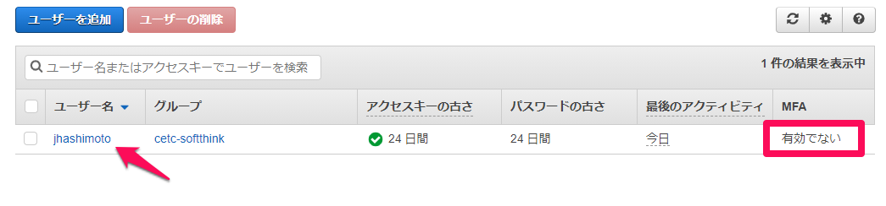

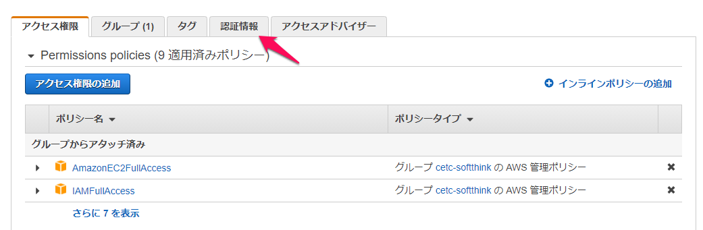

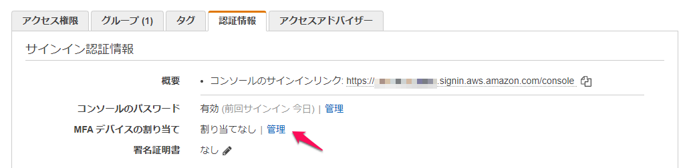

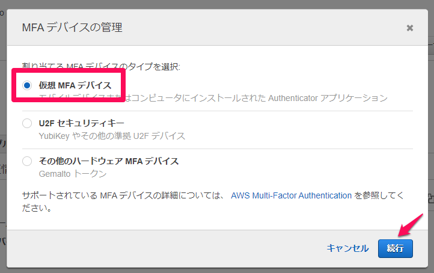

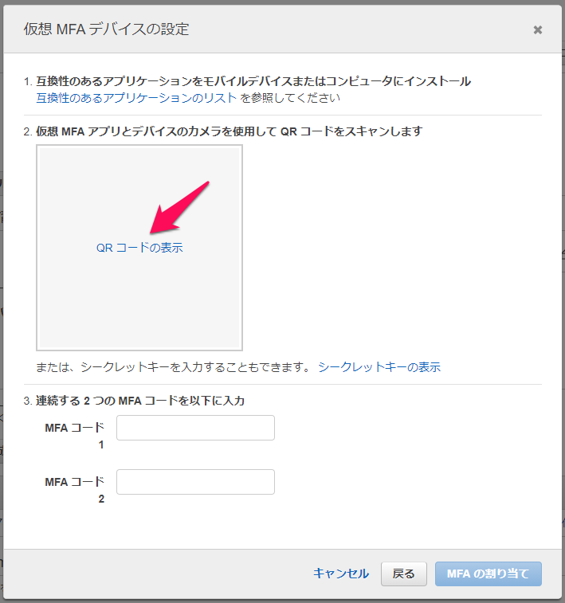

1. アプリケーションをデバイスにインストールする。今回はGoogle Autheticatorを使用する。
1. Google Autheticatorを起動し、QRコードを読み取る。
    [「Google Authenticator」の使い方：設定やバックアップ方法を解説 - 仮想通貨の教科書](https://coin-textbook.com/google-authenticator/)
1. 連続する２つのMFAコード（各6桁）を入力し、[MFAの割り当て]を実行する。
    アプリに表示されているMFAコードは、一定時間経過すると切り替わる。
    [AWSでMFA(二段階認証)を有効にする方法を超丁寧に説明するよ - Qiita](https://qiita.com/viptakechan/items/6d19aee635b2ab189e47)
1. 仮想MFAデバイスが割り当てられていれば成功。
    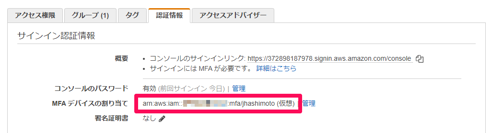

## MFAによるサインイン

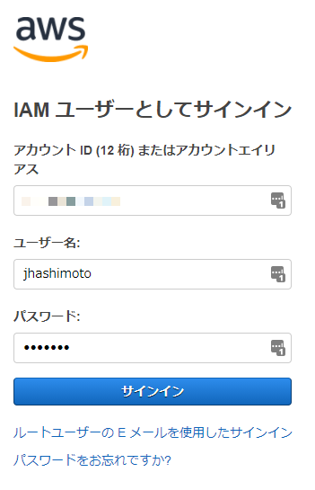

認証に必要な情報を入力して[サインイン]を実行する。

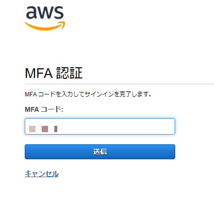

Google Authenticatorに表示されたMFAコードを入力して、[送信]を実行する。アプリに表示されたMFAコードが切り替わる前に送信すること。

## 仮想MFAデバイスの無効化

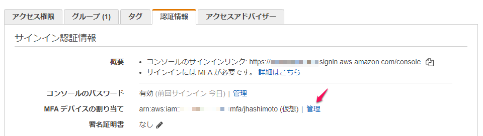

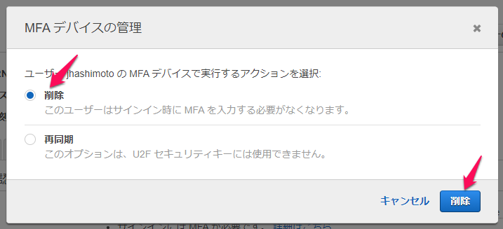

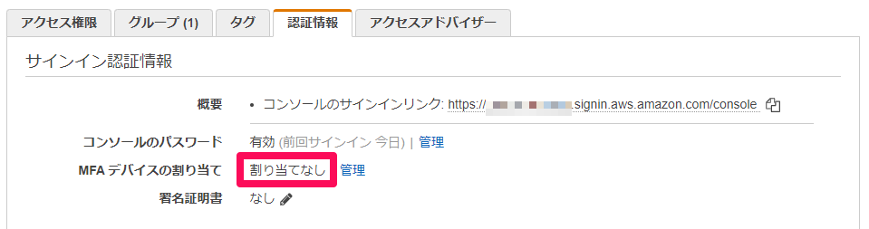

割り当てが解除されていれば成功。

## 参考

[AWS での多要素認証 (MFA) の使用 - AWS Identity and Access Management](https://docs.aws.amazon.com/ja_jp/IAM/latest/UserGuide/id_credentials_mfa.html)

[IAM のサインインページでの MFA デバイスの使用 - AWS Identity and Access Management](https://docs.aws.amazon.com/ja_jp/IAM/latest/UserGuide/console_sign-in-mfa.html)

[IAM - Multi-factor Authentication](https://aws.amazon.com/jp/iam/features/mfa_with_virtual_device/?audit=2019q1) 

Google Authenticator以外に、次のアプリケーションがMFAに使用できる。

> Virtual MFA Applications Applications for your smartphone can be installed from the application store that is specific to your phone type. The following table lists some applications for different smartphone types.  
>
> Android
>
> ​	Authy, Duo Mobile, LastPass Authenticator, Microsoft Authenticator, Google Authenticator
>
> iPhone
>
> ​	Authy, Duo Mobile, LastPass Authenticator, Microsoft Authenticator, Google Authenticator

