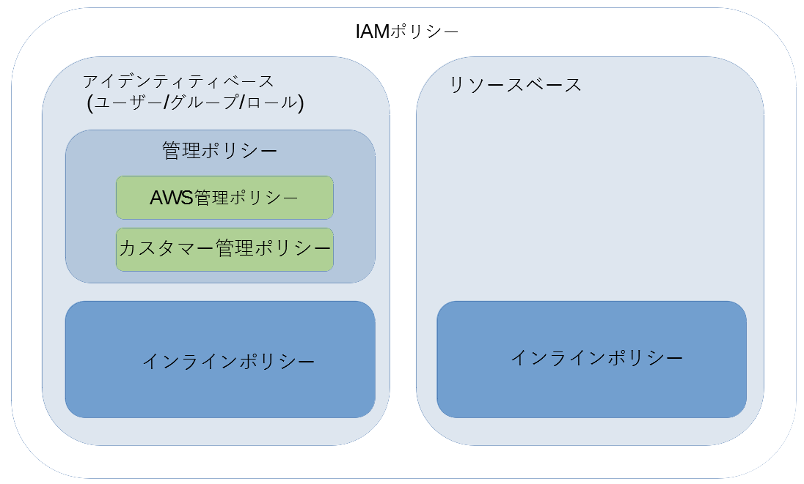

# IAMとは

AWS Identity and Access Management (IAM) は、AWSにおいて認証と認可の仕組みを提供するサービス。

IAMの利用は無料。

- 教科書
    - 6.2 IAMによるユーザーアカウント管理

## IAM概要図

IAMは、主に次の４つの要素から構成される。
- IAMユーザー
    - 組織内の個々の利用者に関連付けられる。
- IAMグループ
    - 複数のユーザーの集合。アクセス許可を一元管理できる。
- IAMロール
    - IAMポリシーが関連付けられている。IAMユーザーに似ているが、特定のユーザー、グループに関連付けられていない。ユーザー、サービスに対してアクセス権を移譲する。
- IAMポリシー
    - リソースへのアクセス許可を定義する。アタッチされた対象に対して、ポリシーで定義されたアクセス許可を移譲する。

Identity and Access Managementの観点から、二種類に分類できる。
- Identity Management（アイデンティティ管理）
    - ユーザー、グループ、ロール
- Access Management（アクセス制御）
    - ポリシー

### アイデンティティとは

アクセス許可を管理する単位のことをアイデンティティと呼ぶ。

IAMでは、アイデンティティのことを**エンティティ**とも呼ぶ。ユーザー、グループ、ロール、サービスがエンティティに該当する。

## IAMロール詳説

### ユーザーに対してロールを適用するには

管理者はIAMユーザーに対して、スイッチロールの権限を許可する。

#### スイッチロールとは

IAMユーザーはスイッチロールを行うことで、ロールに割り当てられたアクセス許可を**一時的に**利用することができる。

また、スイッチロールしている間は、IAMユーザーにアタッチされているポリシーは適用されない。

Linuxの`su`コマンドをイメージするとわかりやすい。

1. ec2-userでログイン
2. rootにsuする
    1. rootのアクセス許可が適用される
    2. ec2-userのアクセス許可は適用されない
3. exit
    1. ec2-userのアクセス許可が適用される

他AWSアカウントにスイッチロール用のロールを提供することで、**AWSアカウントをまたいだリソースの利用が可能になる**。

[ロールの一般的なシナリオ: ユーザー、アプリケーション、およびサービス - AWS Identity and Access Management](https://docs.aws.amazon.com/ja_jp/IAM/latest/UserGuide/id_roles_common-scenarios.html)

> IAM コンソールを使用するアカウントの IAM ユーザーは、別のロールに*切り替えて*、コンソールでそのロールのアクセス許可を一時的に使用できます。ユーザーは、元のアクセス権限を返却し、そのロールに割り当てられたアクセス権限を取得します。ユーザーがそのロールを終了すると、元のアクセス権限に戻ります。

#### 例

- 開発用アカウントのIAMユーザーに本番稼働用アカウントのアプリケーション更新許可を移譲する

    [所有している別の IAM アカウントへのアクセス権を AWS ユーザーに提供 - AWS Identity and Access Management](https://docs.aws.amazon.com/ja_jp/IAM/latest/UserGuide/id_roles_common-scenarios_aws-accounts.html)
#### スイッチロールの設定手順

[IAMのスイッチロールを理解したい | Developers.IO](https://dev.classmethod.jp/articles/iam-switchrole-for-beginner/)

### サービスに対してロールを適用するには

[AWS のサービスにアクセス許可を委任するロールの作成 - AWS Identity and Access Management](https://docs.aws.amazon.com/ja_jp/IAM/latest/UserGuide/id_roles_create_for-service.html?icmpid=docs_iam_console) 

> AWS の多くのサービスでは、ロールを使用して、ユーザーに代わって該当サービスが他のサービスのリソースにアクセスすることを許可する必要があります。サービスがお客様に代わってアクションを実行するために引き受けるロールは、**サービスロール**と呼ばれます。

サービスロールを作成するには、該当のサービスをロールの[信頼されたエンティティ]に設定する。

#### 例

- EC2インスタンスで動作するアプリケーションにEC2へのアクセス許可を移譲する

## IAMポリシー詳説

リソースへのアクセス許可を定義する。アタッチされた対象に対して、ポリシーで定義されたアクセス許可を移譲する。

### ポリシー概要図

ここでは３つの観点でポリシーを分類している。

- 適用する対象は
	- アイデンティティベース
       - アイデンティティにアクセス許可を移譲する
    - リソースベース
        - リソースにアクセス許可を移譲する
            - 例: S3のバケット
- オブジェクトか設定値か
    - 管理ポリシー
        - 単一のオブジェクトとして管理されるポリシー。
        - 複数のアイデンティティで共用できる。
    - インラインポリシー
        - アイデンティティに対して埋め込まれる設定。
        - 複数のアイデンティティで共用できない。同一内容のポリシーであっても各アイデンティティ個別に設定する。
        - インラインポリシーの利用は**非推奨**。
- 管理主体は
    - AWS管理ポリシー
        - AWSが作成および管理するポリシー。利用者がポリシーの設定を変更できない。
    - カスタマー管理ポリシー
        - AWSアカウントで作成および管理する。利用者がポリシーを柔軟に設定できる。

### AWS管理ポリシーとカスタマー管理ポリシーの使い分け

ここでは、ポリシーの使い分けについて説明する。

まず、
- アイデンティティベースであれば、管理ポリシーを利用する。
- リソースべースであれば、インラインポリシーを利用する。
ここまでは、他に選択肢がないので、検討の必要はない。

あとは、アイデンティティベースにおけるAWS管理ポリシーとカスタマー管理ポリシーの使い分けを明確にすればよい。

#### カスタマー管理ポリシーよりもAWS管理ポリシーを使用する

AWS管理ポリシーは一般的なユースケースに適合するように設定されている。要件を満たせるなら、AWS管理ポリシーを利用する。

[IAM ポリシーの作成 - AWS Identity and Access Management](https://docs.aws.amazon.com/ja_jp/IAM/latest/UserGuide/access_policies_create.html)

> AWS 管理ポリシーではなくカスタマー管理ポリシーを使用することもお勧めします。

#### AWS管理ポリシーで要件を満たせない場合

カスタマー管理ポリシーを作成するが、できるだけAWS管理ポリシーと組み合わせる。

##### 許可 + 許可の例

AWS管理ポリシーの許可に加え、カスタマー管理ポリシーで新たな許可を設定する。

- S3フル権限許可 + EC2インスタンス参照許可
    - AmazonS3FullAccess + カスタマー管理ポリシー（EC2インスタンス参照許可）

##### 許可 + 拒否の例

AWS管理ポリシーで許可された権限の一部をカスタマー管理ポリシーで制限する。

- EC2フル権限許可 + 特定インスタンスの停止/開始拒否
    - AmazonEC2FullAccess + カスタマー管理ポリシー（特定インスタンスの停止/開始拒否）
    

同一リソース対して許可と拒否のポリシーが設定された場合は、拒否が優先される。
