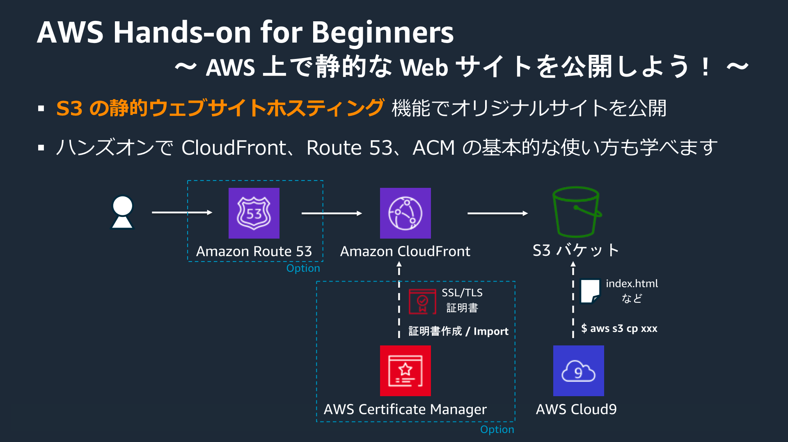

# AWS 上で静的な Web サイトを公開しよう！ 
[ハンズオン資料 | AWS クラウドサービス活用資料集](https://aws.amazon.com/jp/aws-jp-introduction/aws-jp-webinar-hands-on/)

[AWS Hands-on for Beginners - Static Website Hosting | AWS](https://pages.awscloud.com/JAPAN-event-OE-Hands-on-for-Beginners-StaticWebsiteHosting-2020-reg-event-LP.html?trk=aws_introduction_page)

> “AWS Hands-on for Beginners - AWS 上で静的な Web サイトを公開しよう！” 編では、Amazon S3 の静的ウェブサイトホスティング機能を用いて、簡単な Web サイトをインターネット上に公開するハンズオンを行います。このハンズオンシリーズをご視聴いただくと、HTML や CSS を用いて作成したサイト、例えば新規プロタクトのランディングページや個人のポートフォリオサイトなどを容易にホスティングすることができるようになります。 あわせて、Amazon CloudFront という CDN サービスを用いたコンテンツキャッシュ、Amazon Route 53 という DNS サービスを用いた独自ドメインの取得 & ネームサーバーへのレコード登録、AWS Certificate Manager を用いた証明書の作成 & 配置の手順についても学ぶことができます。

